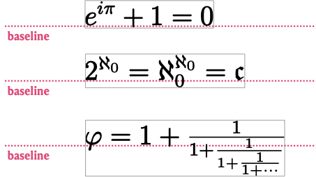

# RaTeX 🐀

A Racket-based (Pollen-based) alternative to MathJaX that brings full-fat LaTeX to the web. No Javascript required!

## Requirements

- A [Pollen](https://docs.racket-lang.org/pollen/)-based website
- The [`uuid`](https://docs.racket-lang.org/uuid/index.html) Racket package (`raco pkg install uuid`)

## Installation

1. Download `ratex.rkt` and place in the same directory as `pollen.tex`.

2. In `pollen.tex` file, paste the following lines near the top:

   ```
   (require "ratex.rkt")
   (provide (all-from-out "ratex.rkt"))
   ```

## Why use RaTeX instead of MathJaX?

1. _No Javascript._ Like anything rendered on the client's side with JavaScript, there's a start-up time tax. As of MathJax 3.0, that wait is brief (and with KaTeX, even briefer) but the more math on the page, the more noticeable the wait.

2. _Full LaTeX functionality_. MathJaX [“includes nearly all of the plain TeX math macros, and many of the LaTeX macros and environments”](https://docs.mathjax.org/en/latest/input/tex/extensions.html), but not all of them. With RaTeX, you can do anything that you can do with LaTeX (for instance, TikZ figures).

3. _More fonts._ As of MathJax 3.0, there's only one available font. This doesn't matter much for mathematical text, but if you frequently include regular text with `\text{...}`, it won't match your body text. With RaTeX, you can use any font you want.

## How to use

There are four document functions

- `◊${...}` for inline math (like `$...$` in LaTeX)
- `◊$${...}` for display math (like `\[...\]` in LaTeX)
- `◊tikz{...}` for tikz figures. This loads a special preamble with the TikZ and pgfplots packages, as well as some common libraries for both packages.
- `◊table[table-format]{...}` for pipe-and-hyphen table generation, like the following
  ```
  ◊table["ccc"]{
  |         | ALPHA | BRAVO |
  | ------- | ----- | ----- |
  | CHARLEY | 1902  | 1290  |
  | VICTOR  | 213   | 345   |
  }
  ```

Each function has the following optional arguments:

- `preamble` (string): This for loading additional LaTeX code in the preamble. This is useful for loading infrequently used packages and defining commands.

  e.g. `◊$[#:preamble "\\newcommand{\\R}{\\mathbb{R}}"]{ \int_\R f(x) }`

  Note that if you frequently load a certain package or command, it might be better to alter the global preamble in the `ratex.rkt` file instead.

- `force` (boolean): By default, RaTeX will only re-render LaTeX when it detects changes. Including `#:force #t` in a command will re-render the equation on every page reload.

  e.g. `◊$$[#:force #t]{ ... }`

- `name` (string): Appends `name` to the LaTeX filenames. Useful for debugging.

  e.g. `◊tikz[#:name "phase-diagram"]{ ... }`

## How RaTeX handles inline math

Since our equations get rendered as SVG, there's nothing telling the browser how to position the image vertically relative to the surrounding text.



To solve this, RaTeX slips a microscopic hot-pink-colored period into the beginning of every inline equation, searches the SVG for that pink dot, grab its height, and uses CSS to shift the equation into place. Is it hacky? Yes. But it works.

## Credits

[Matthew Butterick](https://matthewbutterick.com/), the creator of Pollen

McCoy Becker [(@femtomc)](https://github.com/femtomc), whose [`latex.rkt`](https://github.com/femtomc/pollen-slides/blob/main/pollen/src/latex.rkt) served as the starting point for `ratex.rkt`.
